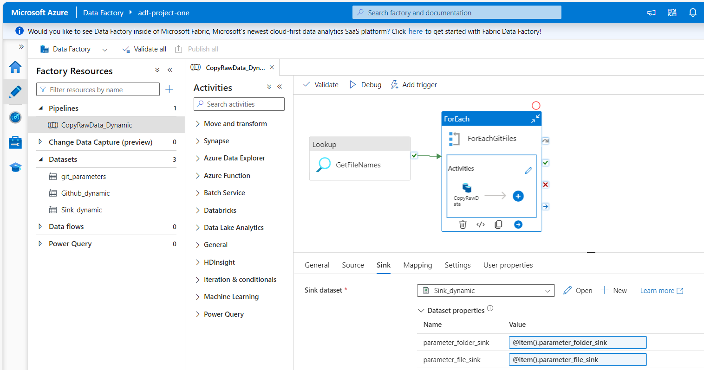
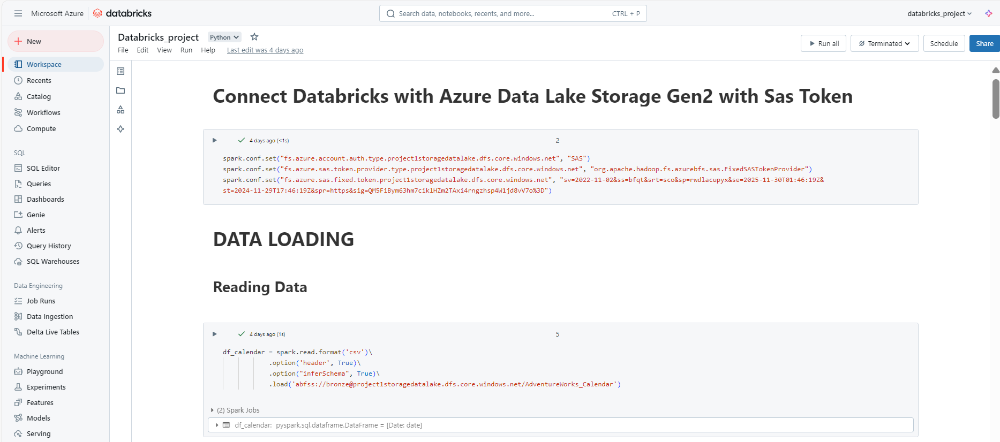
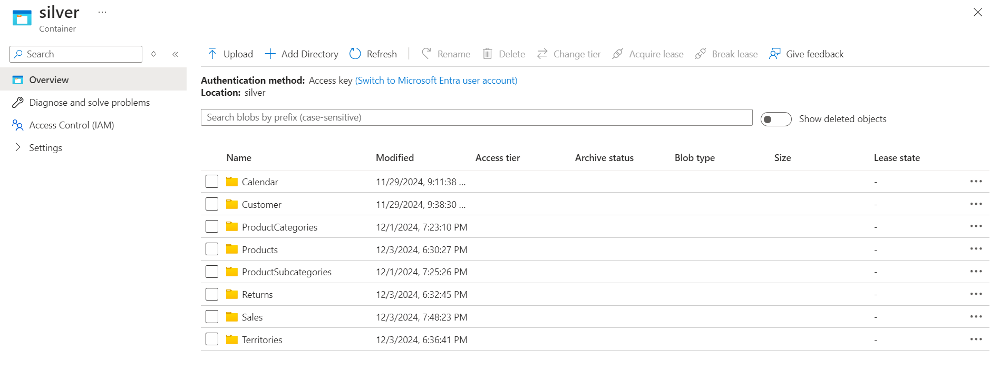
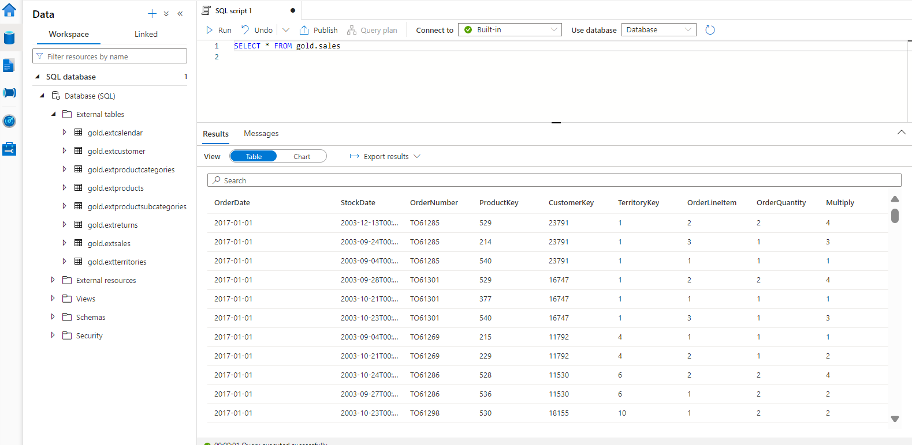

# AdventureWorks Dataset ETL Pipeline with Azure and Databricks

## 📖 Project Overview  
The objective of this project is to design a comprehensive ETL pipeline leveraging the Adventure Works dataset to demonstrate expertise in data engineering. The project highlights the use of tools like Azure Data Factory (ADF), Databricks, PySpark, and Delta Lake for data ingestion, transformation, storage, and analysis.

---

## 📊 Dataset  
The dataset comprises ten CSV files, each containing valuable data related to various aspects of Adventure Works operations
- **Calendar**: Contains date and calendar-related details. 
- **Customer**: Includes customer profiles and information.
- **Product_Categories**: Details about product categories
- **Product_SubCategories**: Information on product subcategories.
- **Products**: Comprehensive data on individual products.
- **Returns**: Tracks product return information.
- **Sales_2015**: Sales data specific to 2015. 
- **Sales_2016**: Sales data specific to 2016.
- **Sales_2017**: Sales data specific to 2017.
- **Territories**: Information about geographical sales territories.
---

## 🔧 Azure Services Utilized
### 1. Azure Data Factory (ADF)
- A cloud-based ETL service designed for data ingestion.
- Pipelines copied raw data from GitHub to Azure Data Lake Storage Gen2 (ADLS Gen2).
### 2. Azure Data Lake Storage Gen2 (ADLS Gen2)
- Centralized storage solution for both raw and processed data.
- Structured into three directories: bronze for unprocessed files, silver for cleaned data, and gold for visualization.
### 3. Azure Databricks
- Analytics platform powered by Apache Spark, utilized for data transformation workflows.
- Executed schema validation, data cleaning, and saved the transformed data back to ADLS Gen2.
### 4. Azure Synapse Analytics
- A comprehensive data warehousing service for structured data storage and querying.
- Integrated with ADLS Gen2 to load and query transformed datasets using a dedicated SQL pool.
---
## 🛠️ ETL Process  

1. **Data Ingestion**  
- Raw data was copied from a GitHub repository using ADF pipelines.  
- Data was stored in the `bronze` folder in ADLS Gen2.
  

2. **Data Transformation**  
- Data was processed in Azure Databricks using PySpark:  
- Loaded CSV files into DataFrames.  
- Performed schema validation and cleaned missing values.  
- Transformed data was written to the `silver` folder in ADLS Gen2.
  

3. **Data Warehousing**  
- Transformed data was linked to Azure Synapse Analytics.  
- Views were created in a SQL pool for querying and analysis.
- Business-level aggregate data was written to the `gold` folder in ADLS Gen2.

---

## ✨ Key Features  
- **Seamless Integration**: Utilizes Azure services for a cohesive pipeline.  
- **Scalability**: Leverages ADLS Gen2 and Synapse Analytics for handling large datasets.  
- **Advanced Transformation**: PySpark in Databricks ensures efficient data processing.  
- **Analytics-Ready Data**: Structured data ready for immediate querying and visualization.

---

 ## 📌 Conclusion 
 
This project demonstrates the power of Azure services in building efficient and scalable ETL pipelines. It highlights how Azure Data Factory, ADLS Gen2, Databricks, Synapse Analytics, and Power BI can be seamlessly integrated to process and analyze real-world datasets. The solution provides a solid foundation for production-grade implementations.---

---
## 👤 Author
- **Name**: Adrian Łobacz
- **Contact**: adrianlobacz.1998@wp.pl
- **LinkedIn**: https://www.linkedin.com/in/adrian-%C5%82obacz-37b66a206/
  
Feel free to contact with me!
